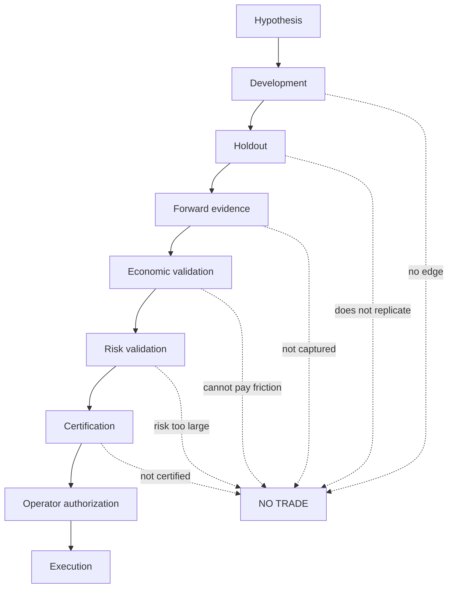
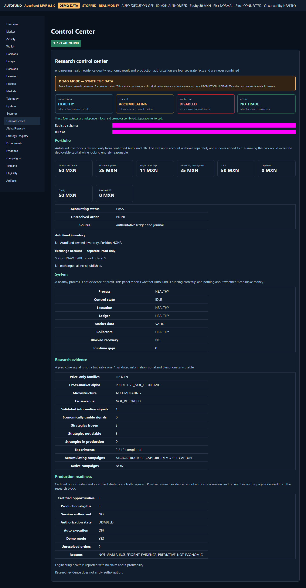
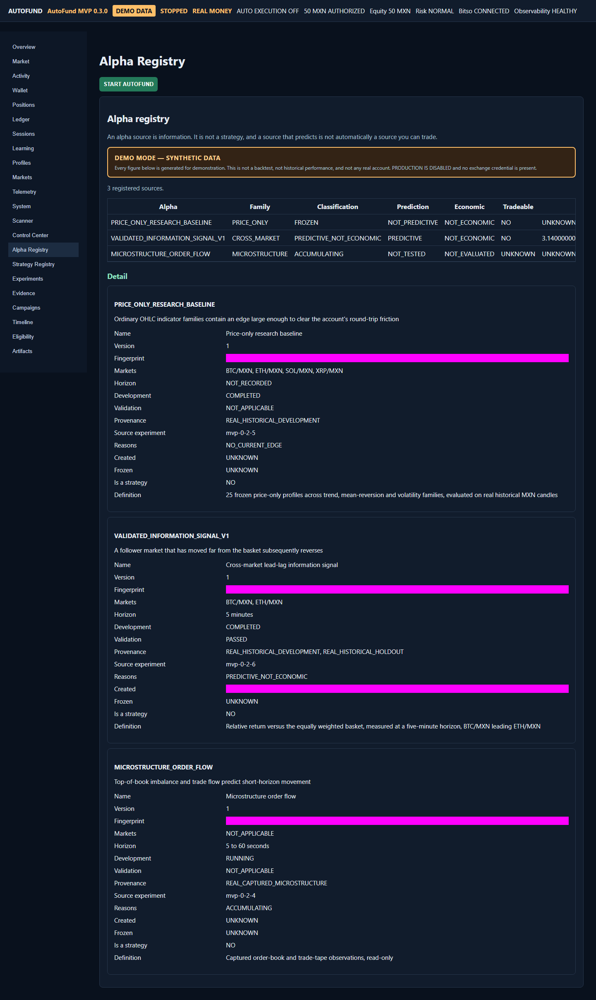
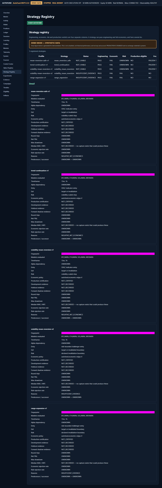
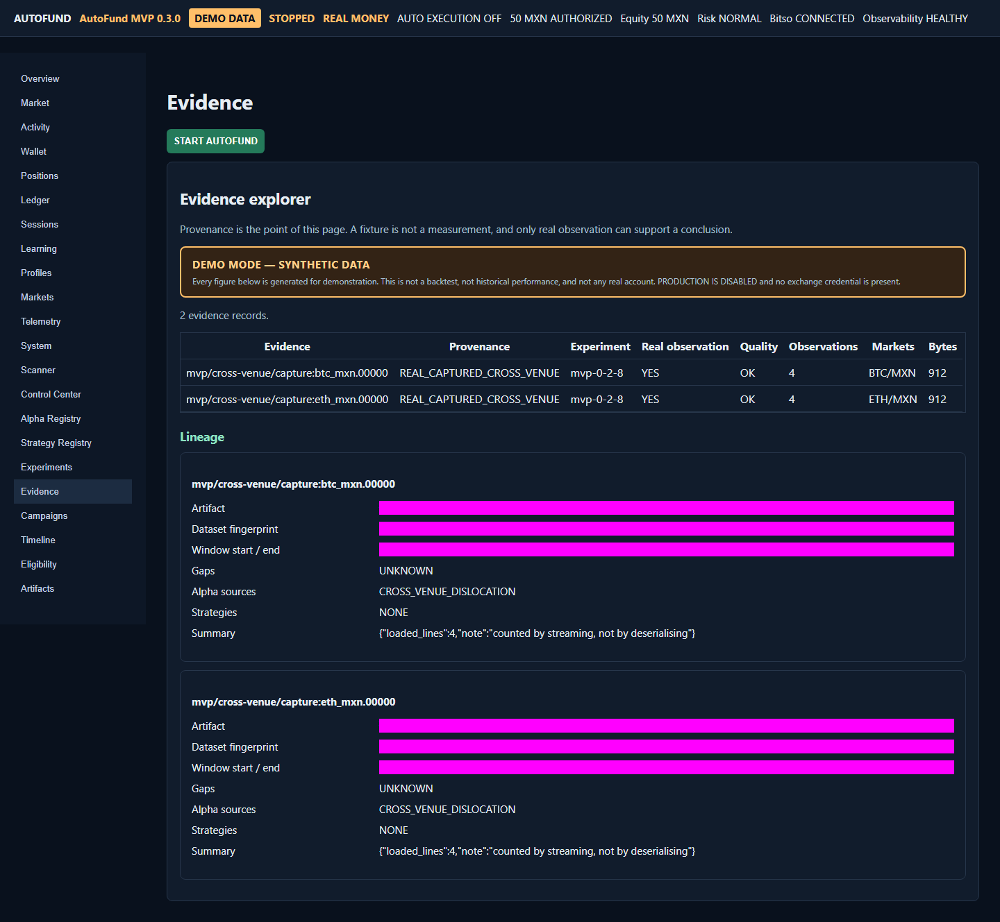
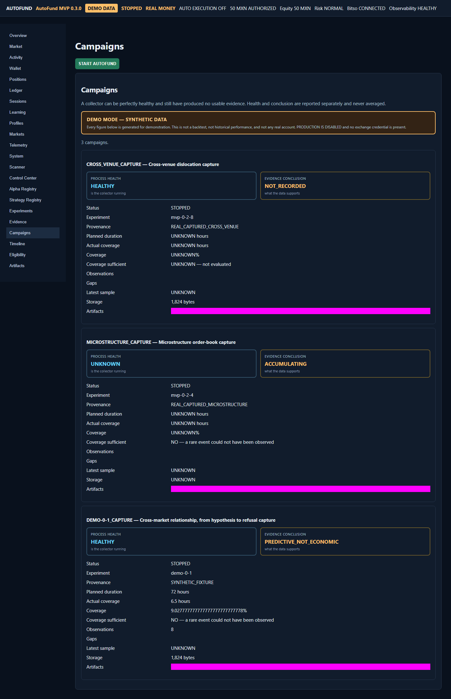
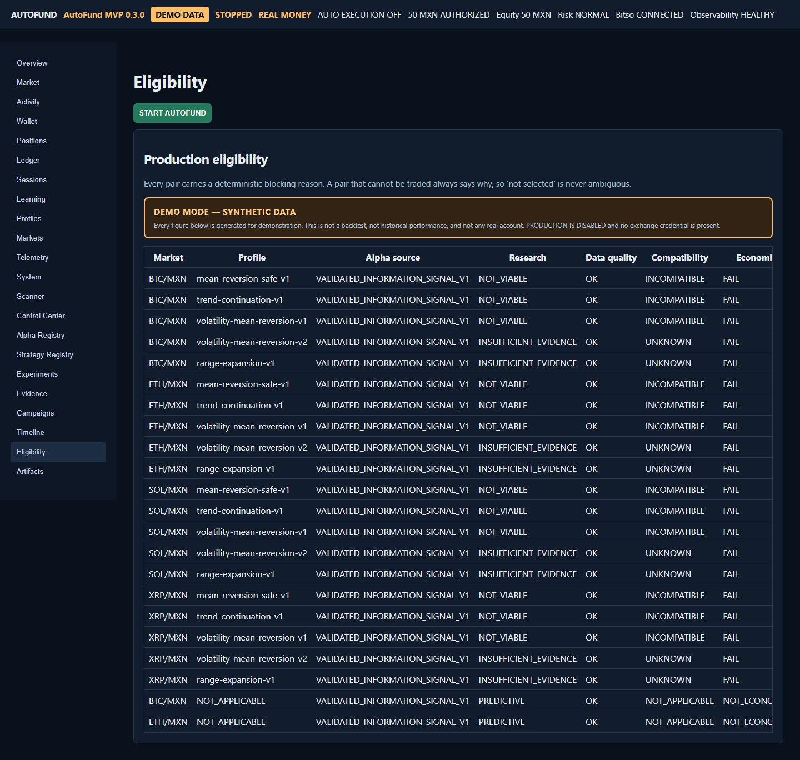

# AutoFund

**AutoFund tests whether a trading idea deserves capital before allowing it to trade.**

It is an evidence-driven research and execution platform. A hypothesis has to survive development,
out-of-sample validation, forward capture, economic validation, risk validation and certification
before a human is even offered the option to authorize a session. Most hypotheses do not survive,
and the system's answer is then `NO_TRADE`.

This repository is public and source-available. **No license has been selected yet**, so it is not
yet open source in the legal sense — see [Licensing](#licensing).

```text
FRESH CLONE → INSTALL → DEMO MODE → RESEARCH CONTROL CENTER
            → SYNTHETIC EVIDENCE → FULL TEST SUITE
            → ZERO CREDENTIALS → ZERO REAL MONEY → ZERO EXCHANGE MUTATION
```

---

## Quick start

Requires **Python 3.11+** and **Node.js 20+**. No exchange account, no credentials and no network
access to any exchange.

### Windows (PowerShell)

```powershell
git clone <repository-url> autofund
cd autofund

python -m venv .venv
.venv\Scripts\python -m pip install --upgrade pip
.venv\Scripts\python -m pip install -e ".[dev]"

cd frontend
npm ci
npm run build
cd ..

.venv\Scripts\autofund demo
```

### macOS / Linux

```bash
git clone <repository-url> autofund
cd autofund

python3 -m venv .venv
.venv/bin/python -m pip install --upgrade pip
.venv/bin/python -m pip install -e ".[dev]"

cd frontend
npm ci
npm run build
cd ..

.venv/bin/autofund demo
```

The application starts on <http://127.0.0.1:8000> and opens a browser. Open the **Control Center**
page in the left navigation.

To start without opening a browser, or on a different port:

```powershell
.venv\Scripts\autofund demo --no-open-browser --port 8080
```

### Running the tests

```powershell
.venv\Scripts\python -m pytest tests -m "not live and not stage"   # backend
cd frontend
npx tsc --noEmit -p tsconfig.json                                   # frontend types
npx vitest run                                                      # frontend unit
npm run build; npx playwright test                                  # end-to-end
```

### Verifying the public safety boundary

```powershell
.venv\Scripts\python scripts\secret_scan.py                  # credentials in the working tree
.venv\Scripts\python scripts\history_secret_audit.py         # credentials in all Git history
.venv\Scripts\python scripts\demo_smoke.py                   # demo cannot reach an exchange
```

---

## Demo mode

Demo mode is **the default**, and it is a mode rather than a separate application: the same code
path runs, with the mode deciding what it is permitted to reach.

- Uses a generated synthetic dataset. **Every figure is invented** and labelled `SYNTHETIC_DEMO`.
- Requires no credentials. If credentials *are* present in your environment, Demo mode **removes
  them from the process** for the duration of the run and restores them afterwards, so a dependency
  or a subprocess cannot pick them up.
- Makes no authenticated exchange request and no exchange mutation. Both are asserted after startup,
  and a violation aborts the process.
- Writes to `artifacts/demo`, never to the directory a real run reads.

The demo dataset is not a backtest. It is not historical performance and not any account's
performance. It exists to show the research workflow.

### Modes

| Mode | Command | Credentials | Exchange access | Can place an order |
|---|---|---|---|---|
| `demo` | `autofund demo` (default) | none | none | **no** |
| `shadow` | `autofund app --mode shadow` | none | public data, read-only | **no** |
| `production` | `autofund app --mode production` | required | authenticated | only after explicit per-session authorization |

An unrecognised `AUTOFUND_MODE` is an error. AutoFund refuses to guess, because guessing wrong in
the production direction spends money.

Configuration is documented in [`.env.example`](.env.example) — variable names and placeholders
only, with no values.

---

## The philosophy



Every stage may end in `NO_TRADE`, and that is a valid system decision rather than a failure. Three
distinctions run through the whole design:

- **Predictive is not profitable.** An information source can predict direction and still be unable
  to pay the round trip. AutoFund reports those as two separate findings.
- **Engineering correctness is not strategy evidence.** Tests passing says the system works, not
  that a strategy makes money. `EngineeringView.says_nothing_about_profitability` is `true` by
  design.
- **Strategy evidence is not production authorization.** Evidence can be strong and a session can
  still be unauthorized. They are separate fields and are never combined into one status.

The project's own research record is mostly negative, and publishing it is deliberate: the ability
to reject a hypothesis before it risks capital is the feature.

---

## What AutoFund does

| Capability | Status |
|---|---|
| Deterministic research and replay engine | Implemented |
| `EconomicEdgeGuard` — fee-aware admission | Implemented |
| `RiskEngine` — position sizing and drawdown policy | Implemented |
| Research registry, rebuilt deterministically from artifacts | Implemented |
| Alpha / strategy / experiment registries | Implemented |
| Evidence provenance, including synthetic vs measured | Implemented |
| Development / holdout separation and forward capture | Implemented |
| MAE / MFE path metrics, reported as `NOT_RECORDED` when absent | Implemented |
| Multi-market MXN data with fee-schedule verification | Implemented |
| Execution recovery and uncertain-order reconciliation | Implemented |
| Financial ledger and accounting with reconciliation | Implemented |
| Wallet vs AutoFund-owned inventory, kept separate | Implemented |
| Microstructure and cross-market / cross-venue research | Implemented |
| **Research Control Center** | Implemented |
| **Demo mode** | Implemented |
| Production safety boundaries (capability gates, single-use permits) | Implemented |
| Experiment Engine / research automation | **Not implemented** — planned for 0.3.1 |
| Strategy lifecycle automation | **Not implemented** |
| Profitable, production-certified strategies | **None. Zero.** |

AutoFund ships **no certified strategy**. The current validated information signal is predictive and
economically unusable at retail friction, and the platform reports it that way.

---

## Safety warning

AutoFund is **experimental software** and is not a financial product.

- It does **not** guarantee profitability. No strategy in this repository is certified.
- Passing the test suite does **not** mean it is safe to point at real capital. The tests verify
  behaviour, not edge.
- Real-money operation requires explicit production configuration and a per-session operator
  authorization with a typed confirmation phrase.
- The default mode is Demo. A new clone cannot reach an exchange.
- The product envelope is fixed in code, not configuration: 50 MXN authorized capital, 25 MXN
  maximum deployment, 11 MXN maximum single order, 0.50 MXN maximum drawdown. There is no
  environment variable that widens these, deliberately — a mistyped variable should not be able to
  raise a financial limit.
- AutoFund has no withdrawal, transfer, cancel or replace capability, and requests no API
  permission for them.

See [SECURITY.md](SECURITY.md) for credential handling and vulnerability reporting.

---

## Documentation

| Document | Contents |
|---|---|
| [docs/architecture.md](docs/architecture.md) | Bounded responsibilities, financial flow, truth separation |
| [docs/research-history.md](docs/research-history.md) | Every milestone, its question and its finding |
| [docs/public-boundary.md](docs/public-boundary.md) | What is published and what stays private |
| [docs/status.md](docs/status.md) | Current project state |
| [docs/roadmap.md](docs/roadmap.md) | Planned direction |
| [docs/releases/v0.3.0.md](docs/releases/v0.3.0.md) | Release notes and known limitations |
| [docs/licensing-decision.md](docs/licensing-decision.md) | License options for the owner to choose |
| [CONTRIBUTING.md](CONTRIBUTING.md) | Development setup and the review expectations |
| [SECURITY.md](SECURITY.md) | Reporting, credential handling, production boundaries |
| [docs/OPERATIONS_RUNBOOK.md](docs/OPERATIONS_RUNBOOK.md) | Operating a real session |

---

## Screenshots

Captured in Demo mode from generated synthetic data. Every figure in these images is invented by
`autofund demo`, and each one carries the `DEMO MODE — SYNTHETIC DATA` banner. They are not anyone's
account, and they are not a backtest.

| View | Image |
|---|---|
| Control Center overview — four separate statuses |  |
| Alpha Registry — a source that predicts and is not economic |  |
| Strategy Registry — engineering `PASS` beside economic `FAIL` |  |
| Evidence Explorer — provenance and lineage per record |  |
| Campaigns — a healthy collector whose coverage is insufficient |  |
| Production eligibility — a blocking reason for every pair |  |

To reproduce them: start `autofund demo` and run `node scripts/capture-docs.mjs` from `frontend/`.
The script refuses to write an image whose page is not labelled synthetic.

---

## Project layout

```text
src/autofund/
  demo/          Demo mode: mode resolution, credential isolation, synthetic dataset
  research/      Research Control Center read model and read-only API
  mvp/           Orchestrator, control plane, economics, risk, execution profile
  live/          Production execution, durable journal, reconciliation
  observer/      Read-only account and market observation
  shadow/        Shadow trading against real public data
  market/        Market data, sessions, candles
  exchanges/     Exchange adapters
frontend/        React control plane and Research Control Center
tests/           Backend test suite
scripts/         Certification, capture and audit tooling
docs/            Architecture, research history and specifications
schemas/         Public data contracts
```

---

## Licensing

**No license has been selected.** This repository is therefore *source-available*, not open source:
without a license, the default is that all rights are reserved, and others have no legal permission
to use, modify or redistribute it.

[`docs/licensing-decision.md`](docs/licensing-decision.md) compares MIT and Apache-2.0 for this
project and sets out what each implies. The choice belongs to the project owner, and it is the one
remaining decision before this repository can be described as open source.

---

## Versioning

Software version and research milestone are tracked separately. The first public release is
`v0.3.0`, not `1.0`: it is a usable research platform, and it has no certified strategy. Version
numbers do not imply profitability, and no version will be called `1.0` because of a research
result.

| Version | Milestone |
|---|---|
| `v0.3.0` | Research Control Center, public release |
| `v0.3.1` | Experiment Engine *(planned)* |
| `v0.3.2` | Research automation *(planned)* |
