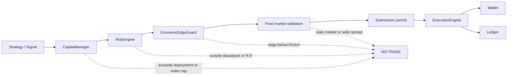
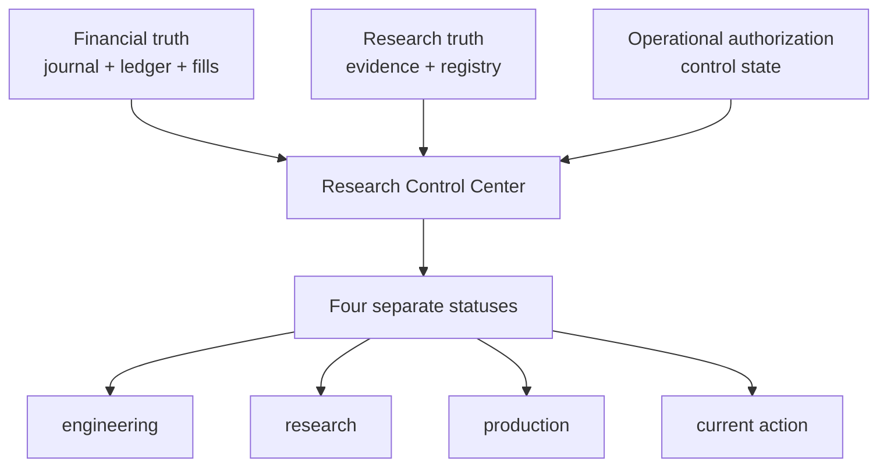
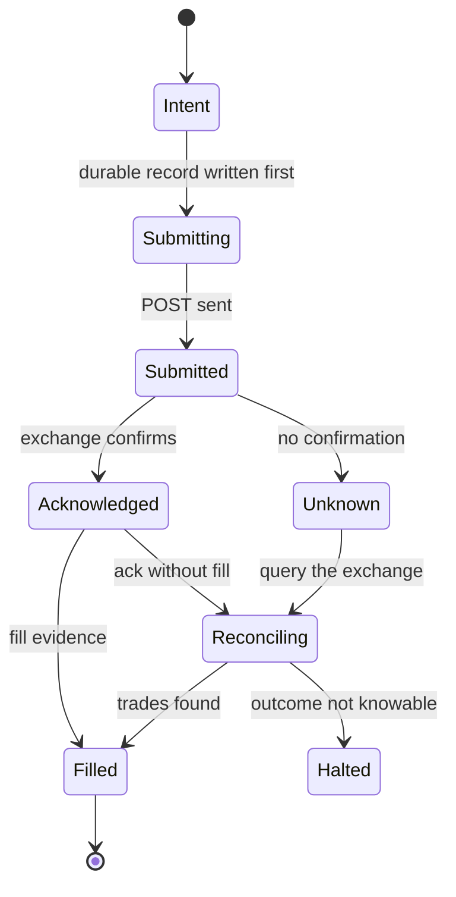
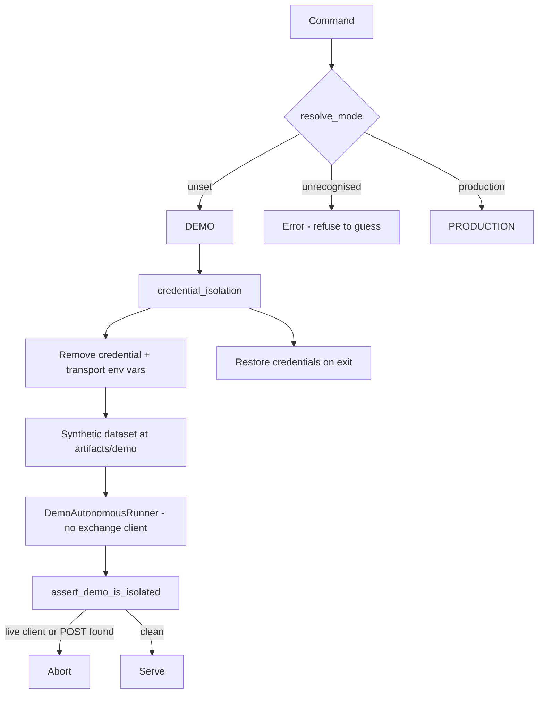
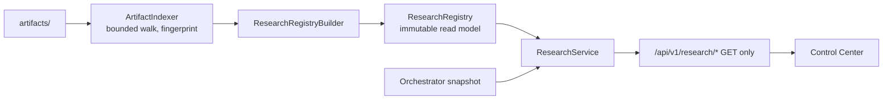

# Architecture

AutoFund is organised so that the part of the system allowed to spend money is small, surrounded by
parts that only ever read or record. This document describes the major bounded responsibilities, the
path a trade takes, and the separations that the rest of the design depends on.

## Bounded responsibilities

```mermaid
flowchart TB
    subgraph ReadOnly["Read-only"]
        MD[Market Data<br/>public candles, order books]
        RES[Research<br/>hypotheses, replay, statistics]
        EVID[Evidence<br/>artifacts, provenance, fingerprints]
        RCC[Research Control Center<br/>read model + read-only API]
    end

    subgraph Decision["Decision - pure, no side effects"]
        ALPHA[Alpha<br/>information sources]
        STRAT[Strategy<br/>entry and exit models]
        ECON[Economics<br/>EconomicEdgeGuard]
        RISK[Risk<br/>RiskEngine]
    end

    subgraph Mutation["Can mutate - narrowly gated"]
        EXEC[Execution<br/>orders, recovery, reconciliation]
        ACC[Accounting<br/>ledger, positions]
        CP[Control Plane<br/>session lifecycle]
    end

    MD --> RES --> ALPHA --> STRAT --> ECON --> RISK --> EXEC --> ACC
    EVID --> RCC
    RES --> EVID
    ACC --> RCC
    CP --> EXEC
    ACC --> CP

    style ReadOnly fill:#0d1726,stroke:#34546b
    style Decision fill:#111c2c,stroke:#6b5a2b
    style Mutation fill:#111c2c,stroke:#b4232c
```

| Component | Responsibility | May it spend money? |
|---|---|---|
| **Market Data** | Public candles and order books. GET-only. | No |
| **Research** | Replay, statistics, hypothesis testing over historical data. | No |
| **Evidence** | Artifact indexing, provenance classification, fingerprints. | No |
| **Alpha** | Information sources and whether they predict. | No |
| **Strategy** | Entry and exit models. Produce proposals, never orders. | No |
| **Economics** | Whether a proposal can pay for itself after friction. | No |
| **Risk** | Whether a trade fits the envelope and reward/risk policy. | No |
| **Execution** | The only component that can submit. Requires a consumed single-use permit. | **Yes, narrowly** |
| **Accounting** | Ledger, positions, reconciliation. Derived from confirmed fills only. | No |
| **Control Plane** | Session lifecycle. START, STOP, KILL. Nothing else. | Indirectly |
| **Research Control Center** | Read model over artifacts. Never writes. | No |

The direction of dependency is one way. Nothing in the read-only row can reach the mutating row, and
that is enforced by the module layout rather than by convention: the Research Control Center imports
the research package, and no research module imports the orchestrator's execution path.

## The financial flow

Every trade passes through the same sequence, and each stage can refuse. The full gate list is
implemented in `strategy_research.py` and reported per evaluation, so a refusal is always
attributable rather than mysterious.

1. **Strategy / Signal** — a profile evaluates closed candles and produces a proposal. A proposal is
   not an instruction; it carries an expected exit reference and no order.
2. **CapitalManager** — checks the proposal against the envelope: authorized capital 50 MXN, maximum
   deployment 25 MXN, maximum single order 11 MXN. These are code constants, not settings.
3. **RiskEngine** — checks the trade against `DRAWDOWN_WITHIN_POLICY` (0.50 MXN), the single-trade
   risk bound (0.50 MXN) and the minimum reward/risk ratio (1.0). A profile with no declared
   invalidation boundary is reported as such rather than vetoed silently.
4. **EconomicEdgeGuard** — the fee-aware gate. It rejects an entry whose expected net edge cannot
   clear round-trip friction at the account's confirmed fee. This is the guard that made most of the
   project's research conclusions negative, and it is deliberately conservative.
5. **Final market validation** — a last GET-only check immediately before any write: freshness,
   spread, depth and data quality. A stale book refuses the trade.
6. **Submission permit** — a single-use object created only after the operator gate. It is consumed
   even if the network call then fails, so a retry cannot reuse it.
7. **ExecutionEngine** — submits, records, reconciles. The only write path to an exchange.
8. **Wallet + Ledger** — the financial record, updated only from *confirmed* fills.

## Truth separation

Three kinds of truth are kept apart. Merging any two of them produces a system that looks more
certain than it is.

| Truth | Authoritative source | Question it answers |
|---|---|---|
| **Financial** | `live/execution.jsonl` journal, ledger, confirmed fills | What do we actually own and owe? |
| **Research** | Certifications, captures, fingerprints, registry | What have we actually measured? |
| **Operational authorization** | Session state machine | Has a human authorised spending real money? |

Why they are separate:

- **A healthy system is not a profitable one.** A process can run correctly while executing a
  strategy that loses money. Reporting one number would hide that.
- **Evidence is not permission.** A strong research finding does not authorize a live session. The
  authorization path requires explicit human action regardless of how good the evidence is.
- **The wallet is not the book.** An exchange account can hold funds that AutoFund does not own.
  Summing the two would overstate deployable capital while looking entirely reasonable, so
  `wallet_is_not_inventory` is `true` and the two are rendered in separate blocks that are never
  added together.
- **Authorization fails closed.** Only the single state `RUNNING` authorizes a session. The check is
  an allowlist, so every state the code has not been taught about — including states a future
  version adds — is unauthorized by default rather than by omission.

## Order safety and uncertain outcomes

The hardest problem in automated trading is not deciding to trade; it is knowing what happened
afterwards. An order can be acknowledged and then fail reconciliation, leaving real money moved and
the system unsure. AutoFund treats that as a first-class state rather than an error to retry.

The rules:

1. **The journal is written before the request.** A submission that is not durably recorded must not
   be sent, because a crash would then leave no trace of an order that may exist.
2. **A permit is consumed even on failure.** A network timeout is not proof the order was rejected.
3. **No blind retry.** An unresolved order blocks new activity in that market and raises
   `HALTED_UNCERTAIN_ORDER` rather than resubmitting, because a retry could double a position.
4. **Outcome is queried, never assumed.** Recovery is GET-only: it looks up the order and its trades
   and classifies the result deterministically.
5. **Reconciliation is idempotent.** Repeated recovery of the same order must not duplicate a fill,
   a ledger entry or a position. This is asserted by test.
6. **The ledger only ever moves on confirmed fills.** An acknowledged order with no trade evidence
   changes no financial state.

This property is documented in `docs/MVP_0_1_2_RECONCILIATION_SPEC.md`, which is the record of a
real incident where an acknowledged order failed reconciliation and the system halted rather than
guessing.

## Demo mode isolation

Demo mode is a mode of the same application, not a separate build. Safety comes from three
independent layers, because each alone is a single point of failure on a property whose violation
costs real money.

1. **Resolution fails closed.** Unset selects Demo; anything unrecognised raises.
2. **Credentials are removed, not ignored.** All credential and transport variables are deleted from
   the process environment for the duration and restored afterwards, so no dependency or subprocess
   can read them.
3. **The boundary is verified after startup.** If a live client was constructed or an authenticated
   request was made, the process aborts rather than continuing.

## Data flow of the Research Control Center

The registry is built once per process and served from memory. The artifacts reach several megabytes,
and re-parsing them per request is the specific performance failure the design avoids. A rebuild is
deterministic: the same inputs produce the same digest, and a read model that indexed its own output
would never converge, so derived output is excluded from the index.

## Exchange adapters

The Bitso adapter is implemented and certified at three levels: public market data (no
authentication), read-only authenticated access, and production trading with a single-use permit.
Credential handling is documented in [SECURITY.md](../SECURITY.md).

AutoFund is **not affiliated with, endorsed by, or partnered with any exchange.** Bitso is the
incumbent venue because it is the venue this project's account is on and the only one whose verified
fee schedule and MXN liquidity were measured; that is a research finding, not an endorsement. The
0.2.7 and 0.2.8 milestones compared Binance, Kraken and Coinbase Advanced as reference venues and
recorded that none of them is compatible with the envelope.

## What is deliberately absent

- **No strategy promotion automation.** Promotion is manual and there is no configuration switch for
  it.
- **No withdrawal, transfer, cancel or replace path.** The API key does not need those permissions
  and the code does not request them.
- **No margin, futures or leverage.**
- **No LLM in the trading path.** Market selection, sizing and certification are deterministic. No
  language model influences any financial decision.
- **No widening of financial limits by configuration.** Envelope constants live in code with tests
  around them.
